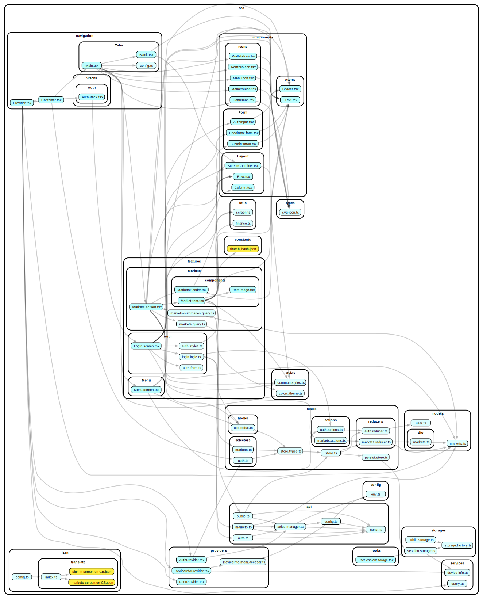

# react-native-tokenize

A fancy, modern, solid conventions, have good development experience React Native Project. Using new techs with well structured.

> I got flu and a fever recently. Hope everything is going well ...

<!-- <video src="./videos/android.webm" /> -->
<video width="375" height="667" controls>
  <source src="./videos/ios.mp4" type="video/mp4">
</video>

<video width="257" height="600" controls>
  <source src="./videos/android.mov" type="video/mp4">
</video>

## Quick start

Ensure you're ready for React Native development with these points.

- Xcode.
- Android studio.
- An IDE, suggested Visual Studio Code.
- Android SDK and JDK installed.
- homebrew, ruby runtime (sometimes), rosetta for Mac M1 and higher, or ensure your terminal works fine on ARM system.
  An LTS node version should match the support versions of React Native. To manage node versions, it is suggested to use n or nvm.
- watchman.
- Flipper for debugging. React Native will eliminate Flipper further and introduce a new Debug UI; feel free to research it.
- If you're working with an RN higher than 0.68, research about Turbo modules, Fabric, JSI, and new architecture would help.

#### Let’s start with CLI provided

```
// to run android
yarn android

// to run ios
yarn ios

// generate thumbhash for Crypto icon from the assets
// from https://tokenize-dev.com/assets/images/currency-logos/${symbol}.png
yarn generate:thumbhash

// check project status and environment requirement
yarn doctor

// run linter with eslint integrated with prettier
yarn lint

// run lint with --fix params
yarn lint:fix

// run tsc compile to verify Typescripts errors
yarn lint:ts
```

## Conventions

This project follows Resilient architecture. Introduced by Monica Lent in GOTO Conferences 2019

Check this video for more details.

https://www.youtube.com/watch?v=TqfbAXCCVwE

Which focuses on organizing code to adapt to changes in code quickly or upgrades, repayment of tech debt, multiple branching, and large teams playing.

#### Conventions

- Source code dependencies must point inward
- Layered your code, be conservative about code reuse
- No dependencies cycle
- Every shared group of configs or constants should have a standalone file for that; don’t mix configs and constants with views.
- Keep files small; be atomic
- No trash commits (Commit with no logic changes, only formatting code for no reason)
- Don't break the rule

#### Linters

Have some rules be applied to boost the development experiences and help code be well maintained.

- Fully typescript validated and no any
- Prettier be integrated with Eslint for unified and automatic file format and linting.
- Husky, commitment, and lint-staged be added to qualify commits
- import sort and unused variable configured to ensure meaningful changes.
- Typescript module imports and absolute imports are configured to make imports stable and readable. It’s time to quit relative imports hell. It also needs Babel config to make the module resolver work.

### Project's tree explained

```
src
├── api
│   ├── auth.ts
│   ├── axios.manager.ts
│   ├── config.ts
│   ├── const.ts
│   ├── markets.ts
│   └── public.ts
├── components
│   ├── Atoms
│   ├── Form
│   ├── Icons
│   └── Layout
├── config
│   └── env.ts
├── constants
│   └── thumb_hash.json
├── features
│   ├── Auth
│   ├── Markets
│   └── Menu
├── hooks
│   └── useSessionStorage.tsx
├── i18n
│   ├── config.ts
│   └── translate
├── models
│   ├── dto
│   ├── markets.ts
│   └── user.ts
├── navigation
│   ├── Container.tsx
│   ├── Provider.tsx
│   ├── Stacks
│   └── Tabs
├── providers
│   ├── AuthProvider.tsx
│   ├── DeviceInfo.mem.accesor.ts
│   ├── DeviceInfoProvider.tsx
│   └── FontProvider.tsx
├── services
│   ├── device-info.ts
│   └── query.ts
├── states
│   ├── actions
│   ├── hooks
│   ├── persist.store.ts
│   ├── reducers
│   ├── selectors
│   ├── store.ts
│   └── store.types.ts
├── storages
│   ├── public.storage.ts
│   ├── session.storage.ts
│   └── storage.factory.ts
├── styles
│   ├── colors.theme.ts
│   └── common.styles.ts
├── types
│   └── svg-icon.ts
└── utils
    ├── finance.ts
    └── screen.ts
```

#### api

> config and implement the Rest API used in the project. Each group of APIs should be separated by multiple instances and provided via Axios.Manager is a factory design pattern object for managing Axios instances.

#### components

> Crafting micro front-end architecture with stateless, small, and simple components. Also easier to changes UI libraries or update whole app styles, UI config with Atoms components. Every single view of project will use exposed components from Atoms instead of use UI libraries directly.

#### config

> Contain Application configs, env variables and global .object

#### constants

> constants, enum, json with never be update on runtime.

#### features

> main UI, be separated by screens. Dependencies point inward.

#### hooks

> shared hooks using in application, for hooks with special purpose or view's hooks, serious considering before push them here.

#### i18n

> Internationalization and Localization configs for the application (Currency, translations, layout configs, time, etc.).

#### models

> Business types, abstract classes or interface there are represent for an entity in project. (Example: User, MarketData, Notification ...etc).

#### navigation

> Navigation setup for the project. Expo router is a good option, boost time so much when setting up new project. But it's not stable right now, and also have some problem with Redirecting. So, we back to config navigation after one day dealing with known issues in expo-router.

#### providers

> Provider design patterns used to ensure data being full filled. Included some important paths like DeviceInfo provider, Expo-Font provider, Auth provider.

#### services

> Abstracting module to use native libraries or life-time callee, event emitters. Make them easy to scale and safe time migrations (Example: Abstracting APIs of DeviceInfo, will save time on the case migrating to Expo Device sdk).

#### states

> State management setting and exposed actions, selectors. I considered between redux-saga, zustand, and Recoil when init states folder. However, following this project’s requirements and complexity, there are not many side effects. So we can consider using the Redux toolkit and the Thunk middleware (integrated inside). Zustand is very fancy, lightweight, and fast. But it has some problems with configurations and shared scope. Btw, the client-states are different from global-states. So, there are not many things to save and rehydrate in redux. Only auth data and market data map were used, and market data was ignored to rehydrate due to frequently changing data.

#### storage

> Using factory pattern to provide local storage powered by MMKV, a fasted local storage for react-native build on top of JSI and Turbo modules. Exposed encrypted storage to store Rehydated data from redux (auth state).

#### styles

> Common styles, colors, and theme configs for the project. Currently, it’s not complete due to some complexity in the concept of UI-kitten. Added to TODO.

#### types

> Share utility types and interfaces used in multiple layers in the project. Because it’s shared on a large scale, it should be independent, in the highest scope, and small.

#### utils

> utilities functions and implementations related to floating point number calculation and display, Screen responsive support, and more ...

### Project dependencies graph



## Techs decisions

#### expo and related uni-modules

> Expo was known as a playground of React Native before. It had slow performance and was heavy, making it hard to configure and install native modules. It wasn’t optimized well on the production level.
> But the game has changed. From Expo SDK 48, released one year ago, Expo fully supports the new architecture of RN and is lightweight. Expo modules are also handy and perform well compared to other community modules. Reduce so much time working with native config and install, abstracting changes on the native side and boost time of migration or upgrading core libraries and React Native versions, upgrade RN, which was a pain-point, now takes just about hourly and never a headache again. Expo router is also a brilliant solution that can reduce about four steps and time spent working with navigation setup and make the project structure clear and beautiful.

#### @ui-kitten and @eva-design

> UI Kitten is an elegant UI library that provides enough and has high-quality UI components and functions. The UI design system Eva is also excellent and follows UI/UX best practices. While Native Base is too slow and heavy, react-native elements need some extra steps to configure and use; UI-kitten is well crafted and is the first candidate for my decision. One thing is that UI-kitten themes or override concepts are very complex and have fewer documents.

#### expo-image

> Modern Image component, better cache strategy, support multiple types of place-holders including thumbhash.

#### expo-font and @expo-google-fonts/roboto

> Easier to use custom fonts in React native.

#### expo-splash-screen

> Asynchronous handle splash screen, credits, easy to configure and use.

#### react-hook-form and yup

> The React hook form is the best way to approach form handling in React Native. It is high performance, lightweight, and well documented.
> Yup schema is robust on validating.

#### @reduxjs/toolkit redux-persist

> Redux toolkit (RTK) is a new approach of redux team to achieve single-source-of-trust and bare-FLUX flow aims. Have less steps to setup and provide better exposed API. It's a good chosen when considering state managements system. Sometimes, the simple is the key point to make project goes long live. So, if you can do it by a simplest way, just do it.

#### react-native-mmkv

> Fastest local storage for React Native, stable and straightforward APIs, encrypted support, and custom database positions support. Easy to integrate with redux-persist.

#### @tanstack/react-query

> Very strong query-states and client's states management tool. It is easy to use and makes code cleaner. Function development friendly due to almost all APIs build on top of hooks.

#### axios

> Powerful HTTP client, support multi-purposes, and more accessible to custom and add middlewares.

#### @react-navigation/native @react-navigation/native-stack

> Strongest and most stable navigation library for React Native. With native-stack, navigation performance is real-native.

#### @shopify/flash-list

> Best big list components for React Native, reborn from react-native-recycle-list-view. Powered by Shopify.

#### bignumber.js

> Handle floating point numbers and do arbitrary-precision decimal and non-decimal arithmetic. Must have when calculating money or price to prevent the floating-point problem of jS.

#### i18next react-i18next

> Credent way to handle translations and i18n values.

#### react-native-svg

> Powerful library to make SVG and vector images available in React Native.

#### react-native-toast-message

> Beauty toast components for React Native, simple APIs, and easy to use.

#### uuid and react-native-get-random-values

> Perfect to generate an uuid in React native.

#### react-native-safe-area-context

> Best solution for padding content inside the safe area or calculating values related to a safe area.

## Contributing

Feel free to fork and create PR if you want to make some changes.

## License

MIT

## Contact

https://github.com/Winglonelion
